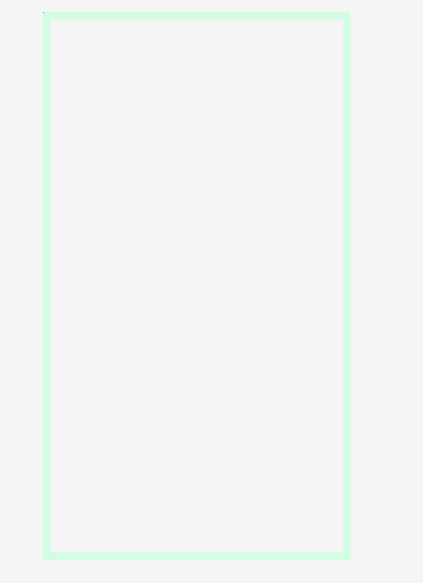

# Android View

### view (= widget = component)

: 안드로이드 화면 구성 요소들


### View 속성

* layout_height : view의 높이
* layout_width : view의 너비
* match_parent : view 사이즈에 꽉차게
* oriental : view의 배치 방향
* id : 식별을 위한 view 이름
* margin : 주위 여백
* padding : 내부 컨텐츠와 border 사이의 간격
* layout_weight : 여백을 해당 view의 사이즈로 포함. view들의 비율
* layout_gravity : parent 내부에서 view 정렬
* gravity : view 내부에서의 정렬


### Android에서 파일명 수정 방법

수정할 파일 우클릭 > Refactor > Rename > 파일명 수정 > Refactoring Preview 창의 Do Refactor 클릭


### MainActivity.java

* setContentView(R.layout.xml-view-name)


---

### Layout 

: view 그룹의 대표적인 예

* Linear Layout (대부분의 화면 구성 가능) : 상대 위치를 계산하기 때문에 연산(ALU작업)이 많아 성능이 떨어짐
* Constraint Layout (우수, 선호) : ios에서 사용하는 layout. relative layout보다 성능이 뛰어남
  * 앵커 포인트 : 참고할 위치를 연결할 포인터
  * Guide Line : view 위치의 기준으로 사용될 수 있다,
* 


# Drawable

### 1. shape

#### Gradiant

:  그라데이션 배경 만들기

drawable 폴더 우클릭 > new > drawable resource file > Root element : shape

```xml
<shape xmlns:android="http://schemas.android.com/apk/res/android"
    android:shape="">
    <gradient
        android:startColor="#99B0DD"
        android:endColor="#766BA8"
        android:centerColor="#D0B2D1"
        android:angle="180"
        />
```

생성 후 layout의 background에 해당 파일로 background 설정

```xml
<LinearLayout ...
              android:background="@drawable/gradient"
              >
...
</LinearLayout>
```

* 실행화면

  


#### line (stroke 속성)

: 외곽 선

```xml
<?xml version="1.0" encoding="utf-8"?>
<shape xmlns:android="http://schemas.android.com/apk/res/android">
    <stroke
        android:color="#D2FDE3"
        android:width="10dp"
        />
</shape>
```


* 실행화면



#### oval

: 타원

```xml
<?xml version="1.0" encoding="utf-8"?>
<shape xmlns:android="http://schemas.android.com/apk/res/android"
    android:shape="oval">
    <solid
        android:color="#B5A9ED"/>
        <stroke
            android:width="50dp"
            android:color="#CFC5E1"
            />

</shape>
```


* 실행화면


#### corner

: 모서리 둥글게

```xml
<?xml version="1.0" encoding="utf-8"?>
<shape xmlns:android="http://schemas.android.com/apk/res/android"
    android:shape="rectangle">
    <solid android:color="#E4C556"
        />
    <corners
        android:bottomLeftRadius="30dp"
        android:bottomRightRadius="30dp"
        android:topLeftRadius="30dp"
        android:radius="30dp"	<!--모든 모서리-->
        />
</shape>
```


### 2. String

: 문자열의 외부화

text를 사용할 때 

res > values > strings.xml 에 문자열과 아이디를 정의하여 사용한다.


배열도 value file로 관리할 수 있다.


```xml
strings.xml
----------------------------------------------------------------------
<resources>
    <string name="app_name">advancedView</string>
    <string name="greet">환영하빈다</string>
    <string name="getdata">입력한 문자 가져오기</string>
    <string name="setdata">문자열 셋팅하기</string>
</resources>
-----------------------------------------------------------------------

layout>xxx.xml
-----------------------------------------------------------------------
<?xml version="1.0" encoding="utf-8"?>
<LinearLayout xmlns:android="http://schemas.android.com/apk/res/android"
    xmlns:app="http://schemas.android.com/apk/res-auto"
    xmlns:tools="http://schemas.android.com/tools"
    android:layout_width="match_parent"
    android:layout_height="match_parent"
    tools:context=".TextTestActivity"
    android:orientation="vertical">

    <TextView
        android:id="@+id/myinfo"
        android:layout_width="match_parent"
        android:layout_height="wrap_content"
        android:textAlignment="center"
        android:layout_gravity="center_horizontal"
        android:text="@string/greet"			<!--선언한 string 입력-->
        tools:layout_editor_absoluteX="169dp"
        tools:layout_editor_absoluteY="65dp"
        android:textAppearance="@style/TextAppearance.AppCompat"
        />

    <EditText
        android:id="@+id/mytext"
        android:layout_width="match_parent"
        android:layout_height="wrap_content"
        android:hint="문자열을 입력하세요"
        android:inputType="number"
        />
    <Button
        android:id="@+id/btnget"
        android:layout_width="match_parent"
        android:layout_height="wrap_content"
        android:text="@string/getdata"
        />
    <Button
        android:id="@+id/btnset"
        android:layout_width="match_parent"
        android:layout_height="wrap_content"
        android:text="@string/setdata"
        />
</LinearLayout>
```


##### - 배열 xml

mydata.xml

```xml
<?xml version="1.0" encoding="utf-8"?>
<resources>
    <string-array name="mylist_data">
        <item>박누리</item>
        <item>김현정</item>
        <item>백지영</item>
        <item>오소리</item>
        <item>차돌박이</item>
        <item>피자</item>
        <item>치킨</item>
        <item>된장찌개</item>
        <item>아이스크림</item>
        <item>짜장면</item>
        <item>짬뽕</item>
        <item>떡볶이</item>
        <item>튀김</item>
        <item>순대</item>
    </string-array>
</resources>
```

